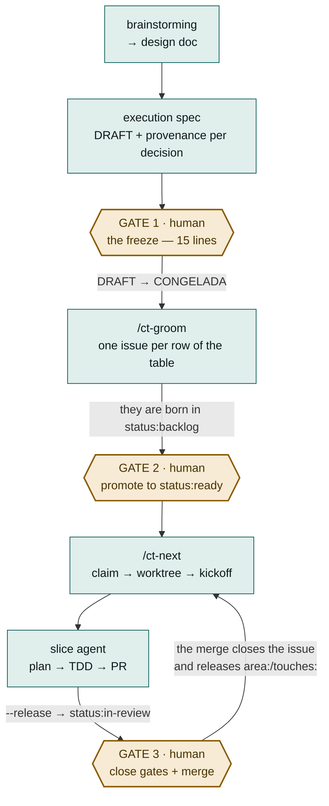

# Control Tower Loop

**A development cycle with agents in which the machine dispatches and verifies, and the human decides exactly three times.**

Control Tower is a [Claude Code](https://code.claude.com/docs) plugin that turns a frozen spec into GitHub issues, dispatches each one to an isolated agent in its own worktree, and keeps count of who is working on what, what has been delivered and what is residue. What it does not do —on purpose— is decide: freezing the spec, promoting a slice to the queue and merging are still human acts.

It is not an orchestrator of parallel agents. It is the opposite: a machine for **not** parallelising what is coupled, and for letting what really is independent move forward without anybody having to remember anything.

| | |
|---|---|
| Version | `0.57.0` <!-- x-release-please-version --> · slice table contract `v23` |
| Commands | `/ct-init` · `/ct-groom` · `/ct-next` · `/ct-status` |
| Human gates | 3 per epic — the freeze, `status:ready`, the merge — plus the `plan` gate on every slice (waivable per row with `!plan`; its go is `-OK <nonce>` and `--release` refuses without it) and the `e2e` gate when the row declares journeys in the `E2E` column (derived, never written by hand) |
| Skills | 11 forked from superpowers 6.0.3 + 1 of our own (`writing-plans-prescriptive`) |
| Requirements | Node ≥ 24 · `gh` authenticated · `cmux` · git worktrees |
| Licence | [MIT](LICENSE) |

> ### 📘 The complete reference
> This README is the overview. The long document —the 16 steps one by one, the state machine, and the **exact format of the 11 artefacts** that travel between steps— is in [`docs/loop/`](https://github.com/mercadona/control-tower/tree/main/docs/loop):
>
> - **[control-tower-loop.pdf](https://github.com/mercadona/control-tower/blob/main/docs/loop/control-tower-loop.pdf)** — 29 pages, to read and to share
> - **[control-tower-loop.html](https://github.com/mercadona/control-tower/blob/main/docs/loop/control-tower-loop.html)** — a self-contained page, one single file, with no network dependencies

---

## The problem it solves

When one agent implements one task, it works. When there are six at once over the same repo, what fails is not the implementation: it is everything around it.

- **Two agents touch the same file** and the second branches from a base that does not contain the first one's work.
- **An agent finishes and nobody finds out**, because «finished» is not a state observable from outside.
- **A PR gets merged and its issue stays open**, so the work that depended on it waits for ever.
- **An agent dies** leaving worktree, branch and terminal window in place, so that every signal goes on saying «alive».
- **The human becomes the message bus**: remembering who had got where, what is left to review and what can be launched already.

Control Tower attacks that by turning each of those things into explicit state —GitHub labels, files under `.agent/`, worktrees with a deterministic name— and into checks that refuse to lie when they cannot verify something.

## The cycle



There are **two live sessions per repo, with opposite roles**: the *coordinator*, in the main checkout, which grooms, dispatches, reviews and merges; and one session *dispatched* per slice, in `.worktrees/<n>`, which implements its own work and stops. Neither of the two does the other's job, and each one carries it written in a `role` field of its state file — not in a prompt, which is lost when it re-hydrates.

### The three gates, and why they exist

| Gate | When | Why the machine cannot close it |
|---|---|---|
| **1 · The freeze** | The spec is written, in `DRAFT` | It is born from a real sentence: *«I do not usually read the specs»*. If the human does not read the spec, whoever writes it could close decisions under somebody else's signature. **15 lines** are presented —the hypothesis, each decision with its provenance, the anti-scope— and it stops. The OK mutates `DRAFT → CONGELADA`. **Without the freeze there is no groom.** |
| **2 · `status:ready`** | The issues already exist | `/ct-groom` creates them in `status:backlog`, never in `ready`. That a slice is written does not mean it should be started now. |
| **3 · The merge** | The PR is open and the claim released | The loop **writes and shows** the gates (`visual`, `apply`) but does not stop you merging with one left unclosed. And the merge is the only thing that releases the area tokens and satisfies the dependencies. |

Gate 3 is still yours, but you no longer have to announce it as well: on delivering, `--release` leaves a detached watcher (`scripts/ct-watch-merge.mjs`) polling the PR of the slice's branch, and as soon as it sees it merged it warns the coordinator that its harvest is pending. It deletes nothing — the warning is the automation; picking up the worktree is still a decision. **It demands one thing of you:** that the coordinator session be a cmux workspace open in the repo's main checkout, because that is where the watcher finds it (the loop does not create it, so there is no name to derive). If it is not, the warning is lost and you find out on the next `/ct-next`, which still detects the pending harvest on its own. And picking it up is no longer a matter of typing the `git` commands by hand: `node <plugin>/scripts/dispatch-check.mjs <n> --repo <o/r> --collect` closes that worktree's cmux session and deletes worktree and branch, but only if the PR is merged, the tree clean and the local tip the commit that landed; if not, it touches nothing and says which of the three fails (`--dry-run` tells you without mutating). With `--bq <project:dataset.table>` —which the backend adds only when it starts with `CT_HARVEST_BQ_TABLE`— before deleting it loads that slice's row into BigQuery (phases, reopens, requeues, PR and the judge's telemetry); if the load fails nothing is deleted and the next sweep retries. And if your flow has no coordinator at all, `--release --no-watch-merge` gives up the watcher out loud instead of leaving it to deliver the warning to somebody who cannot read it.

### The two-level model

Control Tower is the subagent-driven development pattern **one level above**: the slice table is the plan file, `/ct-next` is the coordinator, the dispatched session is the implementer, and the human review of the PR is the *two-stage review*. Inside the worktree, one level further down, the session writes the plan with `writing-plans-prescriptive` and drives the implementation **by consulting `ct-step`** (the state machine as an oracle); the forked skills (`test-driven-development`, `systematic-debugging`…) are loaded by the subagents the machine orders to be dispatched. The same pattern, at two scales.

## Installation

```
/plugin marketplace add mercadona/control-tower
/plugin install control-tower-loop@control-tower
```

> The `owner/repo` shortcut clones over SSH by default; if you prefer HTTPS, export `CLAUDE_CODE_PLUGIN_PREFER_HTTPS=1`.

Then, **once per repo you want to govern**:

```
/ct-init
```

The scaffolder leaves `.agent/STATE.md`, `.agent/conventions.md`, the slice table contract in `docs/superpowers/CONTRATO-SLICES.md`, a short section in `AGENTS.md` that links to it, and the `.gitignore` rules. It plans nothing: filling in the repo's real commands (build, test, lint, CI) in `AGENTS.md` is up to you.

If `/ct-init` warns that the repo **already came with its own conventions** —another claim protocol, another worktrees path, another state file—, the plugin does not resolve that: choosing which one rules is a decision of yours.

### What the environment needs

- **Node ≥ 24** (the three executables are ESM and the hooks are bundled with esbuild).
- **`gh` authenticated** against the repo: all the state lives in GitHub issues, labels and PRs.
- **`cmux`** on the `PATH`: it is what opens the terminal of every dispatched agent. `/ct-next --dry-run` checks that it is there, without running it.
- **A Project v2 with an iteration field named exactly `Sprint`**, only if you use `/ct-groom --project`.

## The four commands

| Command | What it does | Mutates |
|---|---|---|
| **`/ct-init`** | Prepares a repo for the loop: the state, the slice contract in `docs/superpowers/CONTRATO-SLICES.md`, a short section in `AGENTS.md`, the `.gitignore`. Detects conventions of the repo's own that contradict the loop. | the local repo |
| **`/ct-groom`** | Reads the slice table of the **frozen** spec and creates the milestone, the labels, the issues and the entries in the Project. Idempotent by existence; it detects divergence but **does not apply it** without `--reconcile`. | GitHub |
| **`/ct-next`** | Chooses the next dispatchable slice (order, merged dependencies, no token collision, with a `--cap` gap available), claims it, creates worktree and branch, seeds the state and launches the agent **verifying that it really started**. | GitHub + disk |
| **`/ct-status`** | Answers in one go: what is in flight, what has been delivered and what is residue. **It does not write a single time** — there is a test that checks it by looking at the real `argv` `gh` was called with. | nothing |

The four share a channel convention: **stdout is the product** (the plan, the selection, the report, the blocking reason) and **stderr is the diagnosis** (`aviso:`, `ATENCIÓN:`, and every abort). And a grammar of exit codes with three states: done, could not be checked, something is still pending. They are all tabulated in [the complete reference](https://github.com/mercadona/control-tower/blob/main/docs/loop/control-tower-loop.pdf).

Always start dry:

```bash
/ct-groom --dry-run      # validates EXACTLY the same as the real run
/ct-next  --dry-run      # checks what the real run needs, and prints the kickoff in prose
```

## `ct-step`: the sequence of the implementation, decided by a table

Between the plan gate and the pull request there is a stretch that used to be
driven by a chat session following `subagent-driven-development`: it dispatched
one implementer per task, a reviewer behind it, and kept a ledger on disk so as
not to lose its place when the conversation was compacted.

`scripts/ct-step.mjs` **does not replace that session**: it takes one single
responsibility away from it, that of deciding what comes now. The session goes
on driving and goes on dispatching subagents; the sequence is decided by
`scripts/run-machine.js`, a pure function, and the session **consults** it:

```bash
ct-step next                     # "toca implementar la tarea 3; el brief está en X"
ct-step report informe.json      # validates the paths, stages them, transitions
ct-step controls                 # runs the **Verification:** commands and MEASURES
ct-step verdict veredicto.json   # validates against the schema, transitions
ct-step advice consejo.json      # after the SECOND veto: ct-advisor's advice, before the third attempt
ct-step commit                   # validates the message and commits
ct-step reconcile                # after the last task: merges the slice's base, or resolves a conflict with ct-reconciler
ct-step global                   # after the last task: runs ## 8. Global verification
ct-step slice-verdict v.json     # the judgement of the WHOLE slice (ct-slice-judge, with no Bash)
ct-step e2e informe.json         # ONLY if the slice declares journeys: validates, writes the report and commits
```

What changes with respect to today, one line per property:

| | Driving with prose | With `ct-step` |
|---|---|---|
| Who decides the next step | a model reading a skill | a table — and **asking for a step that is not due is refused** (exit `9`) |
| Where the place it has got to lives | a ledger the model writes | `.agent/run-<issue>.json`, which survives a compaction |
| Who measures whether the task is green | the implementer reports it to itself | `ct-step controls`, which also checks that the promised tests exist |
| What the judge can execute | `code-reviewer.md` dispatches a `general-purpose`: it has `Bash` | nothing: `agents/ct-judge.md` declares itself with no `Bash` |
| What the judge returns | prose | a JSON validated against a schema; what does not comply is discarded |
| Who commits | the implementer | the program, and it validates its own message against the closing keywords |
| What the reconciler can execute | — it did not exist | nothing either: `agents/ct-reconciler.md` declares itself `Read, Grep, Glob, Edit` — with no `Bash` and **no `Write`**. It is not caution, it is the mechanism: git does not consider a conflicted file resolved until somebody stages it, and the only one that stages is the program, which knows one single list |
| Who runs `## 8. Global verification` | nobody — the plan declared it and no program ran it | `ct-step global`, after the last task; when it is red the pull request is not opened (exit `11`/`12`) |
| What happens after the SECOND veto of the same task | the third attempt repeated blind, on top of two layers of patches | the `advise` step: `agents/ct-advisor.md` (opus, **`Read` only**) sees the two attempts and the two vetoes and dictates an approach; the program returns the tree to the last commit and the third attempt's brief carries that approach inside it |
| Who judges the WHOLE slice | nobody — the judgement was per task | `agents/ct-slice-judge.md` (with no `Bash`): the slice's end state and the coherence between tasks, with a verdict that travels in its own commit |

**It is the default road since `0.36.0`**: the kickoff `/ct-next` composes
orders the implementation to be driven by consulting `ct-step` (and forbids SDD
as the conductor), and since `0.36.1` `dispatch-check --release` turns it into a
gate — without a **delivered** run (`closed: "delivered"` in
`.agent/run-<issue>.json`) nothing is released (exit `7`), because a prompt is
not a gate. A note of history: upstream this was decision **D-4** of the
convergence document (deferred, owned by José) and
`__tests__/d4-sigue-siendo-de-jose.test.js` watched over it; this fork took it
in `3071d8a`, deleting the test in the same commit that plugged in the kickoff,
as its own header asked.

The design, what was measured in order to take it and what the first real run
taught are in
[`docs/superpowers/specs/2026-08-18-el-conductor-como-programa-design.md`](https://github.com/mercadona/control-tower/blob/main/docs/superpowers/specs/2026-08-18-el-conductor-como-programa-design.md).

**The `e2e` verb is TERMINAL, and conditional.** It is asked for with
`ct-step next` just like any other step, but it only appears in the sequence of
a slice whose row of the table declared journeys in the `E2E` column. After the
last task's commit the tail is the same for every slice — `ct-step reconcile`
(merges the slice's base), `ct-step global` (the `## 8. Global verification`)
and `ct-step slice-verdict` (the judgement of the whole slice) —, and it is
there that it forks: a slice **with no** journeys delivers on that verdict,
without ever passing through `e2e`. The one that does declare them passes
through those two steps and **then**, and only then, `ct-step next` asks for the
journeys the issue lists in `## E2E` to be crossed — the `e2e` is the LAST step
of the tail, never one interleaved between the tasks;
the report (the literal command + the real output of each one) is validated
against `ct-step e2e informe.json`, written to `docs/superpowers/e2e/<issue>.md`,
staged and committed — that commit is what closes the run. If any journey comes
out red, `ct-step` exits with its own **exit `7`** (`E2E_RED` in the `EXIT` of
`scripts/ct-step.mjs` — an exit number of the binary's own, unrelated to the
exit `7` of `dispatch-check --release` above, which is a different program with
its own numbering) and the run stays blocked until it is fixed: there is no way
to release a slice with a journey in the red.

## The state of a slice is a label

There is no database. The state is the issue's labels, and GitHub's timeline records every transition with its timestamp — so it survives a `/clear`, a redispatch and another machine.


The asymmetry that explains most of the real blocks:

| | `status:in-progress` | `status:in-review` |
|---|---|---|
| Takes up `--cap` | yes | **no** |
| Retains `area:` / `touches:` | yes | **yes, until the merge** |
| Satisfies a `merge-after` | no | no — it has to be closed as *completed* |

That is: **an unmerged PR holds up its area neighbours even with no agent running.** The `--release` frees the agent's seat, not the ground.

## What travels between steps

The principle that orders the whole design:

> **What you write outside the slice table and `## Contexto del epic` does not reach the agent.** The agent that implements a slice does not receive the spec: it receives a start-up prompt and the body of the issue. A demand written in another section is invisible however forcefully it is worded.

| Artefact | Who writes it | Where it lives |
|---|---|---|
| Design doc | brainstorming | `docs/superpowers/specs/*-design.md` |
| **Execution spec** | brainstorming | `docs/superpowers/specs/*-execution.md` |
| **Slice table** | the spec's author | a § of the execution spec — the only thing a program parses |
| Issue body | `/ct-groom` | GitHub |
| Labels | `/ct-groom` | GitHub |
| Kickoff | `/ct-next` | an ephemeral prompt + a temporary launcher |
| `SLICE.md` | `/ct-next` seeds it, the agent writes it | `.worktrees/<n>/.agent/` — **ignored by git** |
| `STATE.md` | `/ct-init`, the coordinator | `.agent/` — tracked |
| The slice's plan | the agent, with `writing-plans-prescriptive` | `docs/superpowers/plans/` — committed, travels in the PR |
| PR | the agent | GitHub — with the closing keyword in the **body** |
| `conventions-ack.md` | the human | `.agent/` — silences a warning without deleting documentation |

**The exact format of each one is in [the complete reference](https://github.com/mercadona/control-tower/blob/main/docs/loop/control-tower-loop.pdf)**, taken in every case from the function that emits it, not from a description.

The slice's plan has a mechanical contract (`scripts/plan-contract.js`), and since F-jjponz-4 that contract narrows **what** a code block may carry: each one declares its role —`Current state` (the stretch that changes, checked verbatim against the repo), `Contract` (types, signatures, typed errors, constants that cannot be deduced), `Call site` (how the call is left in the consumer) or `Final text` (documentation)— with its budget of lines. The bodies of the modules and the test files **do not go in the plan**: the implementer writes them with TDD, and the configuration is described in prose. The reason is the `plan` gate: a plan of 74k characters that does not fit in a comment of the issue is not reviewed, it is skimmed — and what travels unreviewed is defects.

### The 5 cell rules of the slice table

They go in the spec's template and not in the contract, because **a human judges them at the freeze, not a parser**:

1. **Clarified = convergence.** A row is ready when two independent readings converge on the same outcome.
2. **`Acepta` = postconditions, not actions.** «An expired token leaves the session at the login», not «the token is refreshed».
3. **`Gate` = the residue of the `Acepta`.** What is observable and *cannot* have a 1:1 test is exactly where the human comes in.
4. **`Dep` declares an interface.** *The most important one.* The `Entrega` of a row with a `Dep` names **what it consumes** of the previous one. A `Dep` that only says `#2` is an undeclared overlap, and the undeclared overlap is what makes reviews get rejected.
5. **`E2E` = does the system have to be up?** An optional column, three states per cell: one or several journeys (comma-separated, `\,` for a comma inside the journey itself), the token `no` (or `n/a` — a positive declaration that there is nothing to cross), or undeclared (only valid if the table does not have this column at all). The `e2e` gate is not written in `Gate`: it is DERIVED from this column carrying some journey — not every slice needs one, and forcing one per row produces filler nobody reads.

## Development

```bash
npm install
npm test            # builds dist/ and runs the suite (vitest)
npm run test:fast   # the suite without the tests that launch a real process
npm run build       # only the bundle of the hooks
```

`npm run test:fast` runs the suite **without the tests that launch a real process**, marked with the suffix `-real-process.test.js` — the same marker the backend uses, because it is the same decision and this repo writes it once. Today only the tests born conformant carry it: of the 77 files of `__tests__/` that launch a process —74 import `node:child_process` and 3 do it through `fixtures/ct-step-harness.js`— **68 are left unmarked**, so the fast subset **is not fast yet**. It is declared debt and it is paid off by renaming. What is already tied down is that a test born conformant cannot spawn without its marker nor carry it as an ornament, nor hide the process behind a fixture: `__tests__/conforming-modules.test.js` measures that.

### The `dist/` rule

`hooks/hooks.json` starts `dist/session-start.js`, `dist/stop.js`, `dist/commit-keyword-guard.js` and `dist/dispatch-guard.js` — **the bundles, not the sources under `hooks/`**. `dist/` is tracked, so:

> **Every change in `hooks/`, or in any module of `scripts/` that those hooks import, has to carry a rebuilt `dist/` in the same commit.**

The same holds for `scripts/vendor/yaml.js`, and for a different reason: **Claude Code installs a plugin by copying it, never by running `npm install`**, so an `import` of an npm package only survives while an untracked `node_modules` travels along for free with the copy — and dies in any installation from git. `scripts/state.js` imports the bundle, not the package, and `__tests__/distribution-boundary.test.js` goes red at any `import` of a package in the runtime code.

Otherwise, the repo goes on distributing the old hook while the source already says something else — and the suite stays **green**, because `npm test` builds first: it tests a freshly made `dist/` while the committed one rots. It really happened. Before committing anything that touches `hooks/`: `npm run build`, and look at the diff of `dist/*.js` as part of the change.

### Structure

```
commands/     the slash commands: invocation, exit code table and a link to their reference under ../docs/loop/
scripts/      the logic — pure modules and the .mjs executables (the loop's four and ct-step)
scripts/vendor/  `yaml` bundled — DERIVED, tracked, see below
hooks/        SessionStart (hydration), Stop (state up to date), PreToolUse over Bash (commit guard) and over Task (the dispatch gate)
dist/         bundles of the hooks — DERIVED, tracked, see above
skills/       the 11 forked skills + writing-plans-prescriptive (our own) + LICENSE-superpowers + FORK.md
__tests__/    133 files, ~3,350 tests
```

And one level further up, in the repo and **outside** what is distributed (the marketplace's
`source` is `./plugin`, so none of this reaches an installation):

```
../docs/loop/  the cycle's document (source, self-contained HTML and PDF) and the long reference of each command: ct-init.md, ct-groom.md, ct-next.md, ct-status.md, ct-harvest.md, ct-scope-gate.md
../docs/       the handoffs of each round (prompt-fNN-*.md) — how we got here
../backend/    the local programming interface the front consumes
../frontend/   the front, still a prepared gap
```

### The superpowers fork

The skills under `skills/` (except `state-template`, our own) are a fork of **superpowers 6.0.3** (Jesse Vincent, MIT — see [`skills/LICENSE-superpowers`](skills/LICENSE-superpowers)), invocable as `control-tower-loop:<name>`. The 11 that were really used were forked, measured over 2,704 transcripts.

**Three seams are rewritten and are not trampled in a cherry-pick** (`__tests__/skills-fork.test.js` watches over them):

1. `brainstorming` — its terminal state is no longer invoking `writing-plans`: it is writing the execution spec and **asking for the freeze**.
2. `subagent-driven-development` — the «there is no plan» branch no longer sends you off to brainstorm: it sends you to write the plan now, scoped to the issue.
3. `finishing-a-development-branch` — step 0: if `.agent/SLICE.md` exists, **there is no menu**. PR + `--release` + stop. The merge is human.

The details and the cherry-pick procedure are in [`skills/FORK.md`](skills/FORK.md).

## Known limits

Written here because a stated limit is operable and an implicit one is not.

- **The claim is not atomic.** The lock an issue is claimed with is GitHub labels, with no compare-and-swap. It is **reproduced and verified**, not suspected, that two dispatchers launched almost at the same time can claim the same token and both start. The mitigation is operational: **do not launch two `/ct-next` at once against the same repo.**
- **Nothing watches the claims between invocations.** The claim is a label, with no heartbeat. And the evidence of life is local to the machine, so «abandoned» is never asserted, only «there is not a trace of it here».
- **The gates are shown, not enforced — except `plan`.** The loop does not stop you merging with a gate left unclosed. The exception is the `plan` gate: since F38 its go is `-OK <nonce>` (one nonce per dispatch, drawn on dispatching and dictated only by the screen of whoever dispatches) and `dispatch-check --release` refuses with **exit 9** without it, so a slice whose plan nobody reviewed never reaches `in-review`.
- **The go of the `plan` gate is not cryptography: agent and coordinator run with the same uid.** The nonce closes the *easy* forgery —the agent can no longer write its own permission with a `gh issue comment`, which is what it used to do and with a trace indistinguishable from the legitimate one— but a determined agent can touch the coordinator's private state, which is the same line behind which every other gate already stands: none of them survives an agent that rewrites the plugin that judges it. And by default the nonce comes out on `stdout`, that is, it protects against the **implementer** agent and not against the coordinator (with `CT_GO_CHANNEL=notify` it enters the context of neither). The complete closure demands a verifier that does not run under that uid —CI, or another identity—: named and unbuilt.
- **The `e2e` report is forgeable.** Nothing stops an agent inventing the `stdout` of a command that never ran: the report is validated in its FORM (the fields the rubric demands for each journey), never in the truth of what it claims to have seen. The only thing that narrows it is that the declared command has to be reproducible — an invented output falls over as soon as somebody pastes it and really runs it.
- **There is no transaction in the groom.** Once the validation is past, a network failure leaves what came before created. There is no rollback and no pretence that there is one: you get out of an abort halfway by running it again, not by cleaning up by hand.
- **`--reconcile` is experimental** and it says so every time. The *detection* half (which never writes) is better understood than the *application* half.
- **The measure is pre-registered, not harvested.** GitHub's timeline already records every transition with its timestamp: half the instrumentation exists without being collected.

And the project's death criterion, which still stands: **if the loop costs more human intervention than it saves, it is said and it stops.** That would also be a result.

## Licence

[MIT](LICENSE), © 2026 José Agüera.

The superpowers fork keeps its original copyright notice, also MIT, in [`skills/LICENSE-superpowers`](skills/LICENSE-superpowers); the modifications are documented in [`skills/FORK.md`](skills/FORK.md).
