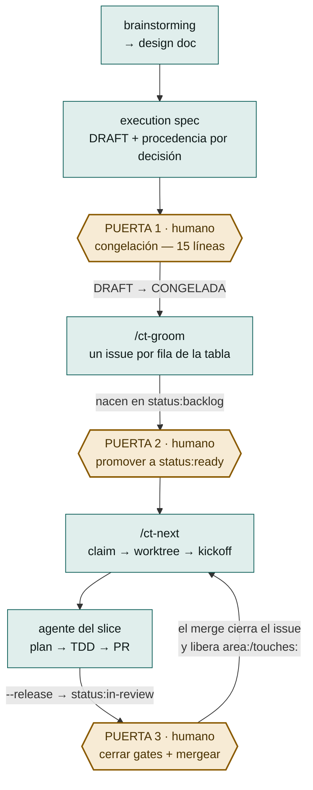
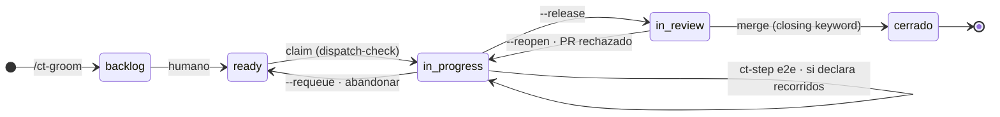

# Control Tower Loop

**Un ciclo de desarrollo con agentes en el que la máquina despacha y verifica, y el humano decide exactamente tres veces.**

Control Tower es un plugin de [Claude Code](https://code.claude.com/docs) que convierte un spec congelado en issues de GitHub, despacha cada uno a un agente aislado en su propio worktree, y lleva la cuenta de quién está trabajando en qué, qué ha entregado y qué es residuo. Lo que no hace —a propósito— es decidir: congelar el spec, promover un slice a la cola y mergear siguen siendo actos humanos.

No es un orquestador de agentes en paralelo. Es lo contrario: una máquina para **no** paralelizar lo que está acoplado, y para que lo que sí es independiente avance sin que nadie tenga que acordarse de nada.

| | |
|---|---|
| Versión | `0.57.0` <!-- x-release-please-version --> · contrato de la tabla de slices `v23` |
| Comandos | `/ct-init` · `/ct-groom` · `/ct-next` · `/ct-status` |
| Puertas humanas | 3 por epic — congelación, `status:ready`, merge — más el gate `plan` en cada slice (renunciable por fila con `!plan`; su go es `-OK <nonce>` y `--release` se niega sin él) y el gate `e2e` cuando la fila declara recorridos en la columna `E2E` (derivado, no se escribe a mano) |
| Skills | 11 forkados de superpowers 6.0.3 + 1 propio (`writing-plans-prescriptive`) |
| Requisitos | Node ≥ 24 · `gh` autenticado · `cmux` · git worktrees |
| Licencia | [MIT](LICENSE) |

> ### 📘 La referencia completa
> Este README es la vista de conjunto. El documento largo —los 16 pasos uno a uno, la máquina de estados, y el **formato exacto de los 11 artefactos** que viajan entre pasos— está en [`docs/loop/`](https://github.com/mercadona/control-tower/tree/main/docs/loop):
>
> - **[control-tower-loop.pdf](https://github.com/mercadona/control-tower/blob/main/docs/loop/control-tower-loop.pdf)** — 29 páginas, para leer y compartir
> - **[control-tower-loop.html](https://github.com/mercadona/control-tower/blob/main/docs/loop/control-tower-loop.html)** — página autocontenida, un solo fichero, sin dependencias de red

---

## El problema que resuelve

Cuando un agente implementa una tarea, funciona. Cuando son seis a la vez sobre el mismo repo, lo que falla no es la implementación: es todo lo que la rodea.

- **Dos agentes tocan el mismo fichero** y el segundo ramifica de una base que no contiene el trabajo del primero.
- **Un agente termina y nadie se entera**, porque «terminado» no es un estado observable desde fuera.
- **Un PR se mergea y su issue se queda abierto**, así que el trabajo que dependía de él espera para siempre.
- **Un agente se muere** dejando worktree, rama y ventana de terminal en su sitio, de modo que todas las señales siguen diciendo «vivo».
- **El humano se convierte en el bus de mensajes**: recuerda quién iba por dónde, qué falta revisar y qué se puede lanzar ya.

Control Tower ataca eso convirtiendo cada una de esas cosas en estado explícito —labels de GitHub, ficheros en `.agent/`, worktrees con nombre determinista— y en comprobaciones que se niegan a mentir cuando no pueden verificar algo.

## El ciclo



Hay **dos sesiones vivas por repo, con papeles opuestos**: la *coordinadora*, en el checkout principal, que groomea, despacha, revisa y mergea; y una sesión *despachada* por slice, en `.worktrees/<n>`, que implementa lo suyo y para. Ninguna de las dos hace el trabajo de la otra, y cada una lo lleva escrito en un campo `role` de su fichero de estado — no en un prompt, que se pierde al re-hidratar.

### Las tres puertas, y por qué existen

| Puerta | Cuándo | Por qué no la puede cerrar la máquina |
|---|---|---|
| **1 · Congelación** | El spec está escrito, en `DRAFT` | Nace de una frase real: *«yo no me suelo leer los specs»*. Si el humano no lee el spec, quien lo escribe podría cerrar decisiones con firma ajena. Se presentan **15 líneas** —hipótesis, cada decisión con su procedencia, anti-scope— y se para. El OK muta `DRAFT → CONGELADA`. **Sin congelación no hay groom.** |
| **2 · `status:ready`** | Los issues ya existen | `/ct-groom` los crea en `status:backlog`, nunca en `ready`. Que un slice esté escrito no significa que se deba empezar ahora. |
| **3 · Merge** | El PR está abierto y el claim liberado | El loop **escribe y enseña** los gates (`visual`, `apply`) pero no impide mergear con uno sin cerrar. Y el merge es lo único que libera los tokens de área y satisface las dependencias. |

La Puerta 3 sigue siendo tuya, pero ya no hace falta que además la anuncies: al entregar, `--release` deja un vigilante desprendido (`scripts/ct-watch-merge.mjs`) sondeando el PR de la rama del slice, y en cuanto lo ve mergeado avisa a la coordinadora de que su cosecha está pendiente. No borra nada — el aviso es la automatización; recoger el worktree sigue siendo una decisión. **Exige una cosa de ti:** que la sesión coordinadora sea una workspace de cmux abierta en el checkout principal del repo, porque es por ahí por donde el vigilante la encuentra (a ella no la crea el loop, así que no hay ningún nombre que derivar). Si no lo está, el aviso se pierde y te enteras en el siguiente `/ct-next`, que sigue detectando la cosecha pendiente él solo. Y recogerla ya no es teclear los `git` a mano: `node <plugin>/scripts/dispatch-check.mjs <n> --repo <o/r> --collect` cierra la sesión de cmux de ese worktree y borra worktree y rama, pero solo si la PR está mergeada, el árbol limpio y la punta local es el commit que aterrizó; si no, no toca nada y dice cuál de las tres falla (`--dry-run` lo cuenta sin mutar). Con `--bq <proyecto:dataset.tabla>` —que el backend añade solo cuando arranca con `CT_HARVEST_BQ_TABLE`— antes de borrar carga en BigQuery la fila de ese slice (fases, reopens, requeues, PR y telemetría del juez); si la carga falla no se borra nada y el siguiente barrido reintenta. Y si tu flujo no tiene coordinadora en absoluto, `--release --no-watch-merge` renuncia al vigilante en voz alta en vez de dejarlo entregar el aviso a quien no sabe leerlo.

### El modelo de dos niveles

Control Tower es el patrón de desarrollo dirigido por subagentes **un nivel por encima**: la tabla de slices es el fichero de plan, `/ct-next` es el coordinador, la sesión despachada es el implementador, y la revisión humana del PR es el *two-stage review*. Dentro del worktree, un nivel más abajo, la sesión escribe el plan con `writing-plans-prescriptive` y conduce la implementación **consultando `ct-step`** (la máquina de estados como oráculo); los skills forkados (`test-driven-development`, `systematic-debugging`…) los cargan los subagentes que la máquina manda despachar. El mismo patrón, dos escalas.

## Instalación

```
/plugin marketplace add mercadona/control-tower
/plugin install control-tower-loop@control-tower
```

> El atajo `owner/repo` clona por SSH por defecto; si prefieres HTTPS, exporta `CLAUDE_CODE_PLUGIN_PREFER_HTTPS=1`.

Luego, **una vez por repo que quieras gobernar**:

```
/ct-init
```

El scaffolder deja `.agent/STATE.md`, `.agent/conventions.md`, el contrato de la tabla de slices en `docs/superpowers/CONTRATO-SLICES.md`, una sección corta en `AGENTS.md` que enlaza a él, y las reglas del `.gitignore`. No planifica nada: rellenar los comandos reales del repo (build, test, lint, CI) en `AGENTS.md` es cosa tuya.

Si `/ct-init` avisa de que el repo **ya traía sus propias convenciones** —otro protocolo de claim, otra ruta de worktrees, otro fichero de estado—, eso no lo resuelve el plugin: elegir cuál manda es una decisión tuya.

### Qué necesita el entorno

- **Node ≥ 24** (los tres ejecutables son ESM y los hooks se bundlean con esbuild).
- **`gh` autenticado** contra el repo: todo el estado vive en issues, labels y PRs de GitHub.
- **`cmux`** en el `PATH`: es quien abre el terminal de cada agente despachado. `/ct-next --dry-run` comprueba que esté, sin ejecutarlo.
- **Un Project v2 con un campo de iteración llamado exactamente `Sprint`**, sólo si usas `/ct-groom --project`.

## Los cuatro comandos

| Comando | Qué hace | Muta |
|---|---|---|
| **`/ct-init`** | Prepara un repo para el loop: estado, contrato de slices en `docs/superpowers/CONTRATO-SLICES.md`, sección corta en `AGENTS.md`, `.gitignore`. Detecta convenciones propias del repo que contradigan al loop. | el repo local |
| **`/ct-groom`** | Lee la tabla de slices del spec **congelado** y crea milestone, labels, issues y altas en el Project. Idempotente por existencia; detecta divergencia pero **no la aplica** sin `--reconcile`. | GitHub |
| **`/ct-next`** | Elige el siguiente slice despachable (orden, dependencias mergeadas, sin colisión de tokens, con hueco de `--cap`), lo reclama, crea worktree y rama, siembra el estado y lanza al agente **verificando que arrancó de verdad**. | GitHub + disco |
| **`/ct-status`** | Responde de una vez: qué está en vuelo, qué ha entregado y qué es residuo. **No escribe una sola vez** — hay un test que lo comprueba mirando el `argv` real con el que se llamó a `gh`. | nada |

Los cuatro comparten convención de canal: **stdout es el producto** (el plan, la selección, el informe, el motivo de bloqueo) y **stderr es el diagnóstico** (`aviso:`, `ATENCIÓN:`, y todo aborto). Y una gramática de códigos de salida con tres estados: hecho, no se pudo comprobar, queda algo pendiente. Están todos tabulados en [la referencia completa](https://github.com/mercadona/control-tower/blob/main/docs/loop/control-tower-loop.pdf).

Empieza siempre en seco:

```bash
/ct-groom --dry-run      # valida EXACTAMENTE lo mismo que la corrida real
/ct-next  --dry-run      # comprueba lo que el run real necesita, e imprime el kickoff en prosa
```

## `ct-step`: la secuencia de la implementación, decidida por una tabla

Entre el gate del plan y la pull request hay un tramo que antes conducía una
sesión de chat siguiendo `subagent-driven-development`: despachaba un
implementador por tarea, un revisor detrás, y mantenía un ledger en disco para
no perder el sitio cuando la conversación se compactara.

`scripts/ct-step.mjs` **no sustituye a esa sesión**: le quita una sola
responsabilidad, la de decidir qué toca ahora. La sesión sigue conduciendo y
sigue despachando subagentes; la secuencia la decide `scripts/run-machine.js`,
una función pura, y la sesión la **consulta**:

```bash
ct-step next                     # "toca implementar la tarea 3; el brief está en X"
ct-step report informe.json      # valida las rutas, las stagea, transiciona
ct-step controls                 # ejecuta los comandos de **Verification:** y MIDE
ct-step verdict veredicto.json   # valida contra el esquema, transiciona
ct-step advice consejo.json      # tras el SEGUNDO veto: el consejo de ct-advisor, antes del tercer intento
ct-step commit                   # valida el mensaje y comitea
ct-step reconcile                # tras la última tarea: fusiona la base del slice, o resuelve un conflicto con ct-reconciler
ct-step global                   # tras la última tarea: corre ## 8. Global verification
ct-step slice-verdict v.json     # el juicio del slice ENTERO (ct-slice-judge, sin Bash)
ct-step e2e informe.json         # SOLO si el slice declara recorridos: valida, escribe el informe y comitea
```

Lo que cambia respecto de hoy, en una línea por propiedad:

| | Conduciendo con prosa | Con `ct-step` |
|---|---|---|
| Quién decide el paso siguiente | un modelo leyendo una skill | una tabla — y **pedir un paso que no toca se rechaza** (exit `9`) |
| Dónde vive el sitio en el que va | un ledger que el modelo escribe | `.agent/run-<issue>.json`, que sobrevive a una compactación |
| Quién mide si la tarea está verde | el implementador se lo reporta a sí mismo | `ct-step controls`, que además comprueba que los tests prometidos existen |
| Qué puede ejecutar el juez | `code-reviewer.md` despacha un `general-purpose`: tiene `Bash` | nada: `agents/ct-judge.md` se declara sin `Bash` |
| Qué devuelve el juez | prosa | un JSON validado contra un esquema; lo que no cumple se descarta |
| Quién comitea | el implementador | el programa, y valida su propio mensaje contra las closing keywords |
| Qué puede ejecutar el reconciliador | — no existía | nada tampoco: `agents/ct-reconciler.md` se declara `Read, Grep, Glob, Edit` — sin `Bash` y **sin `Write`**. No es cautela, es el mecanismo: git no da por resuelto un fichero en conflicto hasta que alguien lo stagea, y el único que stagea es el programa, que conoce una única lista |
| Quién ejecuta `## 8. Global verification` | nadie — el plan la declaraba y ningún programa la corría | `ct-step global`, tras la última tarea; en rojo no se abre la pull request (exit `11`/`12`) |
| Qué pasa tras el SEGUNDO veto de la misma tarea | el tercer intento repetía a ciegas, encima de dos capas de parches | el paso `advise`: `agents/ct-advisor.md` (opus, **sólo `Read`**) ve los dos intentos y los dos vetos y dicta un enfoque; el programa devuelve el árbol al último commit y el brief del tercer intento lleva ese enfoque dentro |
| Quién juzga el slice ENTERO | nadie — el juicio era por tarea | `agents/ct-slice-judge.md` (sin `Bash`): el fin del slice y la coherencia entre tareas, con veredicto que viaja en su propio commit |

**Es el camino por defecto desde `0.36.0`**: el kickoff que compone `/ct-next`
manda conducir la implementación consultando `ct-step` (y prohíbe SDD como
conductor), y desde `0.36.1` `dispatch-check --release` lo convierte en gate —
sin un run **entregado** (`closed: "delivered"` en `.agent/run-<issue>.json`)
no se libera (exit `7`), porque un prompt no es un gate. Nota de historia: en
upstream esto era la decisión **D-4** del documento de convergencia (aplazada,
dueño José) y la vigilaba `__tests__/d4-sigue-siendo-de-jose.test.js`; este
fork la tomó en `3071d8a`, borrando el test en el mismo commit que enchufó el
kickoff, como su propia cabecera pedía.

El diseño, lo que se midió para tomarlo y lo que la primera corrida real enseñó
están en
[`docs/superpowers/specs/2026-08-18-el-conductor-como-programa-design.md`](https://github.com/mercadona/control-tower/blob/main/docs/superpowers/specs/2026-08-18-el-conductor-como-programa-design.md).

**El verbo `e2e` es TERMINAL, y condicional.** Se pregunta con `ct-step next`
igual que cualquier otro paso, pero solo aparece en la secuencia de un slice
cuya fila de la tabla declaró recorridos en la columna `E2E`. Tras el commit de
la última tarea la cola es la misma para todos los slices — `ct-step reconcile`
(fusiona la base del slice), `ct-step global` (la `## 8. Global verification`)
y `ct-step slice-verdict` (el juicio del slice entero) —, y es ahí donde se
bifurca: un slice **sin** recorridos entrega en ese veredicto, sin pasar nunca
por `e2e`. El que sí los declara pasa por esos dos
pasos y **entonces**, y solo entonces, `ct-step next` pide atravesar los
recorridos que el issue lista en `## E2E` — el `e2e` es el ÚLTIMO paso de la
cola, nunca uno intercalado entre las tareas;
el informe (comando literal + salida real de cada uno) se valida contra
`ct-step e2e informe.json`, se escribe en `docs/superpowers/e2e/<issue>.md`, se
stagea y se comitea — ese commit es lo que cierra el run. Si algún recorrido
sale rojo, `ct-step` sale con su propio **exit `7`** (`E2E_RED` en el `EXIT` de
`scripts/ct-step.mjs` — un número de salida propio del binario, sin relación
con el exit `7` de `dispatch-check --release` de más arriba, que es un
programa distinto con su propia numeración) y el run se queda bloqueado hasta
que se corrija: no hay forma de liberar un slice con un recorrido en rojo.

## El estado de un slice es una label

No hay base de datos. El estado son las labels del issue, y el timeline de GitHub registra cada transición con su timestamp — así sobrevive a un `/clear`, a un redespacho y a otra máquina.



La asimetría que explica la mayoría de los bloqueos reales:

| | `status:in-progress` | `status:in-review` |
|---|---|---|
| Ocupa `--cap` | sí | **no** |
| Retiene `area:` / `touches:` | sí | **sí, hasta el merge** |
| Satisface un `merge-after` | no | no — hace falta cerrar como *completed* |

Es decir: **un PR sin mergear frena a sus vecinos de área aunque no haya ningún agente corriendo.** El `--release` libera la plaza de agente, no el terreno.

## Lo que viaja entre pasos

El principio que ordena todo el diseño:

> **Lo que escribas fuera de la tabla de slices y de `## Contexto del epic` no llega al agente.** El agente que implementa un slice no recibe el spec: recibe un prompt de arranque y el cuerpo del issue. Una exigencia escrita en otra sección es invisible por muy contundente que esté redactada.

| Artefacto | Quién lo escribe | Dónde vive |
|---|---|---|
| Design doc | brainstorming | `docs/superpowers/specs/*-design.md` |
| **Execution spec** | brainstorming | `docs/superpowers/specs/*-execution.md` |
| **Tabla de slices** | el autor del spec | § del execution spec — lo único que un programa parsea |
| Cuerpo del issue | `/ct-groom` | GitHub |
| Labels | `/ct-groom` | GitHub |
| Kickoff | `/ct-next` | prompt efímero + launcher temporal |
| `SLICE.md` | `/ct-next` siembra, el agente escribe | `.worktrees/<n>/.agent/` — **ignorado por git** |
| `STATE.md` | `/ct-init`, la coordinadora | `.agent/` — trackeado |
| Plan del slice | el agente, con `writing-plans-prescriptive` | `docs/superpowers/plans/` — commiteado, viaja en el PR |
| PR | el agente | GitHub — con la closing keyword en el **cuerpo** |
| `conventions-ack.md` | el humano | `.agent/` — silencia un aviso sin borrar documentación |

**El formato exacto de cada uno está en [la referencia completa](https://github.com/mercadona/control-tower/blob/main/docs/loop/control-tower-loop.pdf)**, sacado en cada caso de la función que lo emite, no de una descripción.

El plan del slice tiene contrato mecánico (`scripts/plan-contract.js`), y desde F-jjponz-4 ese contrato acota **qué** puede llevar un bloque de código: cada uno declara su rol —`Current state` (el tramo que cambia, comprobado verbatim contra el repo), `Contract` (tipos, firmas, errores tipados, constantes no deducibles), `Call site` (cómo queda la llamada en el consumidor) o `Final text` (documentación)— con su presupuesto de líneas. Los cuerpos de los módulos y los ficheros de test **no van en el plan**: los escribe el implementador con TDD, y la configuración se describe en prosa. El motivo es el gate `plan`: un plan de 74k caracteres que no cabe en un comentario del issue no se revisa, se hojea — y lo que viaja sin revisar son defectos.

### Las 5 reglas de celda de la tabla de slices

Van en la plantilla del spec y no en el contrato, porque **las juzga un humano al congelar, no un parser**:

1. **Clarificado = convergencia.** Una fila está lista cuando dos lecturas independientes convergen en el mismo desenlace.
2. **`Acepta` = postcondiciones, no acciones.** «El token caducado deja la sesión en login», no «se refresca el token».
3. **`Gate` = residuo de los `Acepta`.** Lo observable que *no* puede tener test 1:1 es exactamente donde entra el humano.
4. **`Dep` declara interfaz.** *La más importante.* La `Entrega` de una fila con `Dep` nombra **qué consume** de la anterior. Un `Dep` que sólo dice `#2` es un solape sin declarar, y el solape sin declarar es lo que hace que las reviews se rechacen.
5. **`E2E` = ¿hace falta el sistema en pie?** Columna opcional, tres estados por celda: uno o varios recorridos (coma-separados, `\,` para una coma dentro del propio recorrido), el token `no` (o `n/a` — declaración positiva de que no hay nada que atravesar), o sin declarar (sólo válido si la tabla no tiene esta columna en absoluto). El gate `e2e` no se escribe en `Gate`: se DERIVA de que esta columna traiga algún recorrido — no todos los slices lo necesitan, y forzar uno por fila produce relleno que nadie lee.

## Desarrollo

```bash
npm install
npm test            # construye dist/ y corre la suite (vitest)
npm run test:fast   # la suite sin los tests que lanzan un proceso de verdad
npm run build       # sólo el bundle de los hooks
```

`npm run test:fast` corre la suite **sin los tests que lanzan un proceso de verdad**, marcados con el sufijo `-real-process.test.js` — el mismo marcador que usa el backend, porque es la misma decisión y este repo la escribe una vez. Hoy sólo lo llevan los tests nacidos conformes: de los 77 ficheros de `__tests__/` que lanzan un proceso —74 importan `node:child_process` y 3 lo hacen a través de `fixtures/ct-step-harness.js`— quedan **68 sin marcar**, así que el subset rápido **todavía no es rápido**. Es deuda declarada y se salda renombrando. Lo que ya está atado es que un test nacido conforme no puede espawnear sin su marcador ni llevarlo de adorno, ni esconder el proceso detrás de un fixture: lo mide `__tests__/modulos-conformes.test.js`.

### La regla del `dist/`

`hooks/hooks.json` arranca `dist/session-start.js`, `dist/stop.js`, `dist/commit-keyword-guard.js` y `dist/dispatch-guard.js` — **los bundles, no los fuentes de `hooks/`**. `dist/` está trackeado, así que:

> **Todo cambio en `hooks/`, o en cualquier módulo de `scripts/` que esos hooks importen, tiene que llevar un `dist/` reconstruido en el mismo commit.**

Lo mismo vale para `scripts/vendor/yaml.js`, y por una razón distinta: **Claude Code instala un plugin copiándolo, nunca corriendo `npm install`**, así que un `import` de un paquete npm sólo sobrevive mientras un `node_modules` sin trackear viaje de gorra con la copia — y muere en cualquier instalación desde git. `scripts/state.js` importa el bundle, no el paquete, y `__tests__/frontera-de-distribucion.test.js` se pone rojo ante cualquier `import` de un paquete en el código de runtime.

Si no, el repo sigue distribuyendo el hook viejo mientras la fuente ya dice otra cosa — y la suite se queda **en verde**, porque `npm test` construye primero: prueba un `dist/` recién hecho mientras el commiteado se pudre. Pasó de verdad. Antes de commitear algo que toque `hooks/`: `npm run build`, y mira el diff de `dist/*.js` como parte del cambio.

### Estructura

```
commands/     los slash commands: invocación, tabla de exit codes y enlace a su referencia en ../docs/loop/
scripts/      la lógica — módulos puros y los ejecutables .mjs (los cuatro del loop y ct-step)
scripts/vendor/  `yaml` bundleado — DERIVADO, trackeado, ver abajo
hooks/        SessionStart (hidratación), Stop (estado al día), PreToolUse sobre Bash (guarda de commits) y sobre Task (puerta del despacho)
dist/         bundles de los hooks — DERIVADO, trackeado, ver arriba
skills/       los 11 skills forkados + writing-plans-prescriptive (propio) + LICENSE-superpowers + FORK.md
__tests__/    133 ficheros, ~3.350 tests
```

Y un nivel más arriba, en el repo y **fuera** de lo que se distribuye (el `source` del
marketplace es `./plugin`, así que nada de esto llega a una instalación):

```
../docs/loop/  el documento del ciclo (fuente, HTML autocontenido y PDF) y la referencia larga de cada comando: ct-init.md, ct-groom.md, ct-next.md, ct-status.md, ct-harvest.md, ct-scope-gate.md
../docs/       los handoffs de cada ronda (prompt-fNN-*.md) — cómo se llegó hasta aquí
../backend/    la interfaz de programación local que consume el front
../frontend/   el front, todavía un hueco preparado
```

### El fork de superpowers

Los skills de `skills/` (salvo `state-template`, propio) son un fork de **superpowers 6.0.3** (Jesse Vincent, MIT — ver [`skills/LICENSE-superpowers`](skills/LICENSE-superpowers)), invocables como `control-tower-loop:<nombre>`. Se forkaron los 11 que se usaban de verdad, medido sobre 2.704 transcripts.

**Tres costuras están reescritas y no se pisan en un cherry-pick** (las vigila `__tests__/skills-fork.test.js`):

1. `brainstorming` — su estado terminal ya no es invocar `writing-plans`: es escribir el execution spec y **pedir la congelación**.
2. `subagent-driven-development` — la rama «no hay plan» ya no manda a brainstormear: manda a escribir el plan ahora, scoped al issue.
3. `finishing-a-development-branch` — paso 0: si existe `.agent/SLICE.md`, **no hay menú**. PR + `--release` + parar. El merge es humano.

Los detalles y el procedimiento de cherry-pick están en [`skills/FORK.md`](skills/FORK.md).

## Límites conocidos

Escritos aquí porque un límite dicho es operable y uno implícito no.

- **El claim no es atómico.** El lock con el que se reclama un issue son labels de GitHub, sin compare-and-swap. Está **reproducido y verificado**, no sospechado, que dos dispatchers lanzados casi a la vez pueden reclamar el mismo token y arrancar los dos. La mitigación es operativa: **no lances dos `/ct-next` a la vez contra el mismo repo.**
- **Nada vigila los claims entre invocaciones.** El claim es una label, sin heartbeat. Y la evidencia de vida es local a la máquina, así que nunca se afirma «abandonado», sólo «aquí no hay ni rastro».
- **Los gates se enseñan, no se imponen — salvo `plan`.** El loop no impide mergear con un gate sin cerrar. La excepción es el gate `plan`: desde F38 su go es `-OK <nonce>` (un nonce por despacho, sorteado al despachar y dictado sólo por la pantalla de quien despacha) y `dispatch-check --release` se niega con **exit 9** sin él, así que un slice cuyo plan nadie revisó no llega a `in-review`.
- **El go del gate `plan` no es criptografía: agente y coordinadora corren con el mismo uid.** El nonce cierra la falsificación *fácil* —el agente ya no puede escribir su propio permiso con un `gh issue comment`, que es lo que hacía y con una traza indistinguible de la legítima— pero un agente decidido puede tocar el estado privado de la coordinadora, que es la misma línea detrás de la que ya están todos los demás gates: ninguno sobrevive a un agente que reescribe el plugin que lo juzga. Y por defecto el nonce sale por `stdout`, o sea que protege del agente **implementador** y no de la coordinadora (con `CT_GO_CHANNEL=notify` no entra en el contexto de ninguno). El cierre completo exige un verificador que no corra bajo ese uid —CI, u otra identidad—: nombrado y sin construir.
- **El informe de `e2e` es falsificable.** Nada impide que un agente invente el `stdout` de un comando que nunca corrió: el informe se valida en la FORMA (los campos que la rúbrica exige por cada recorrido), nunca en la verdad de lo que dice haber visto. Lo único que lo acota es que el comando declarado tenga que ser reproducible — una salida inventada se cae en cuanto alguien la pega y la corre de verdad.
- **No hay transacción en el groom.** Superada la validación, un fallo de red deja creado lo anterior. No hay rollback y no se finge que lo haya: de un abort a mitad se sale volviendo a correr, no limpiando a mano.
- **`--reconcile` es experimental** y lo avisa cada vez. La mitad de *detección* (que nunca escribe) está mejor entendida que la mitad de *aplicación*.
- **La medida está pre-registrada, no cosechada.** El timeline de GitHub ya registra cada transición con su timestamp: media instrumentación existe sin recoger.

Y el criterio de muerte del proyecto, que sigue vigente: **si el loop cuesta más intervención humana de la que ahorra, se dice y se para.** Eso también sería un resultado.

## Licencia

[MIT](LICENSE), © 2026 José Agüera.

El fork de superpowers conserva su aviso de copyright original, también MIT, en [`skills/LICENSE-superpowers`](skills/LICENSE-superpowers); las modificaciones están documentadas en [`skills/FORK.md`](skills/FORK.md).
