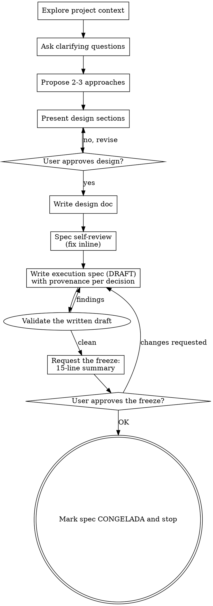

# Brainstorming Ideas Into Designs

Help turn ideas into fully formed designs and specs through natural collaborative dialogue.

Start by understanding the current project context, then ask questions one at a time to refine the idea. Once you understand what you're building, present the design and get user approval.

<HARD-GATE>
Do NOT invoke any implementation skill, write any code, scaffold any project, or take any implementation action until you have presented a design and the user has approved it. This applies to EVERY project regardless of perceived simplicity.
</HARD-GATE>

## Anti-Pattern: "This Is Too Simple To Need A Design"

Every project goes through this process. A todo list, a single-function utility, a config change — all of them. "Simple" projects are where unexamined assumptions cause the most wasted work. The design can be short (a few sentences for truly simple projects), but you MUST present it and get approval.

## Checklist

You MUST create a task for each of these items and complete them in order:

1. **Explore project context** — read `.agent/conventions.md` and its listed documents, then check files, docs and recent commits. Follow the declared skills where applicable.
2. **Offer the visual companion just-in-time** — NOT upfront. The first time a question would genuinely be clearer shown than described, offer it then (its own message); on approval its browser tab opens for you. If no visual question ever arises, never offer it. See the Visual Companion section below.
3. **Ask clarifying questions** — one at a time, understand purpose/constraints/success criteria
4. **Propose 2-3 approaches** — with trade-offs and your recommendation
5. **Present design** — in sections scaled to their complexity, get user approval after each section
6. **Write design doc** — save to `docs/superpowers/specs/YYYY-MM-DD-<topic>-design.md` and commit. It becomes the `Handoff origen:` of the execution spec — after the freeze it is history, nobody edits it.
7. **Spec self-review** — quick inline check for placeholders, contradictions, ambiguity, scope (see below)
8. **Write the execution spec** — `docs/superpowers/specs/YYYY-MM-DD-<topic>-execution.md` from this plugin's `../../templates/_TEMPLATE-execution-spec.md`, state DRAFT. Every frozen decision carries its provenance and the freeze refuses while one keeps quiet: `hablada` / `deducida` / `propuesta` / `historia <id>` / `prd <name>` / `prototipo <version>` (see below)
9. **Validate the draft** — run this plugin's `../../scripts/ct-spec-check.mjs` against the written file and resolve its findings before presenting it as ready.
10. **Request the freeze (congelación)** — present the 15-line summary and STOP. The user's OK mutates `DRAFT → CONGELADA`. Without it there is no groom.

## Process Flow

**The terminal state is the frozen execution spec.** Do NOT invoke writing-plans, frontend-design, or any other implementation skill. The plan of each slice is written later by the dispatched agent at kickoff, scoped to its issue — not here, not now.

## The Process

**Understanding the idea:**

- Check out the current project state first (files, docs, recent commits)
- Read `.agent/conventions.md` and the documents it lists before designing. This index selects the repository's rules; it does not replace them. If the index is missing, empty or points to unreadable files, ask the person to identify the existing convention sources instead of inventing defaults. Keep those rules in their existing documents, not copied into each execution spec.
- Before asking detailed questions, assess scope: if the request describes multiple independent subsystems (e.g., "build a platform with chat, file storage, billing, and analytics"), flag this immediately. Don't spend questions refining details of a project that needs to be decomposed first.
- If the project is too large for a single spec, help the user decompose into sub-projects: what are the independent pieces, how do they relate, what order should they be built? Then brainstorm the first sub-project through the normal design flow. Each sub-project gets its own spec → plan → implementation cycle.
- For appropriately-scoped projects, ask questions one at a time to refine the idea
- Prefer multiple choice questions when possible, but open-ended is fine too
- Only one question per message - if a topic needs more exploration, break it into multiple questions
- Focus on understanding: purpose, constraints, success criteria

**Exploring approaches:**

- Propose 2-3 different approaches with trade-offs
- Present options conversationally with your recommendation and reasoning
- Lead with your recommended option and explain why

**Presenting the design:**

- Once you believe you understand what you're building, present the design
- Scale each section to its complexity: a few sentences if straightforward, up to 200-300 words if nuanced
- Ask after each section whether it looks right so far
- Cover: architecture, components, data flow, error handling, testing
- Be ready to go back and clarify if something doesn't make sense

**Design for isolation and clarity:**

- Break the system into smaller units that each have one clear purpose, communicate through well-defined interfaces, and can be understood and tested independently
- For each unit, you should be able to answer: what does it do, how do you use it, and what does it depend on?
- Can someone understand what a unit does without reading its internals? Can you change the internals without breaking consumers? If not, the boundaries need work.
- Smaller, well-bounded units are also easier for you to work with - you reason better about code you can hold in context at once, and your edits are more reliable when files are focused. When a file grows large, that's often a signal that it's doing too much.

**Working in existing codebases:**

- Explore the current structure before proposing changes. Follow existing patterns.
- Where existing code has problems that affect the work (e.g., a file that's grown too large, unclear boundaries, tangled responsibilities), include targeted improvements as part of the design - the way a good developer improves code they're working in.
- Don't propose unrelated refactoring. Stay focused on what serves the current goal.

## After the Design

**Documentation:**

- Write the validated design (spec) to `docs/superpowers/specs/YYYY-MM-DD-<topic>-design.md`
  - (User preferences for spec location override this default)
- Use elements-of-style:writing-clearly-and-concisely skill if available
- Commit the design document to git

**Spec Self-Review:**
After writing the spec document, look at it with fresh eyes:

1. **Placeholder scan:** Any "TBD", "TODO", incomplete sections, or vague requirements? Fix them.
2. **Internal consistency:** Do any sections contradict each other? Does the architecture match the feature descriptions?
3. **Scope check:** Is this focused enough for a single implementation plan, or does it need decomposition?
4. **Ambiguity check:** Could any requirement be interpreted two different ways? If so, pick one and make it explicit.

Fix any issues inline. No need to re-review — just fix and move on.

**Execution Spec:**
After the self-review passes, write the execution spec: `docs/superpowers/specs/YYYY-MM-DD-<topic>-execution.md`, created from `../../templates/_TEMPLATE-execution-spec.md` relative to this skill's base directory, state `DRAFT`. Resolve the template and checker from this same installed plugin, not from the working directory or another installed copy. The design document is its `Handoff origen:`. Create the destination directory if necessary.

An old `docs/superpowers/specs/_TEMPLATE-execution-spec.md` in the repository is not the format authority. Read it for local additions if it exists, preserve the file, and ask where any unique repository rules belong in the existing convention documents. Do not carry obsolete format instructions into new specs. Existing frozen specs stay unchanged.

- The spec records the join AND its compressed inputs: what the executor needs and cannot derive.
- **Provenance per frozen decision** (D-1, D-2…), as the suffix `*(Procedencia: …)*` at the end of the decision, on ONE line: `hablada` (with the user's phrase when possible), `deducida` (follows from something hablada), `propuesta` (yours), or the source that decided it by name — `historia <id>`, `prd <name>`, `prototipo <version>`. **A `propuesta` is never frozen** — ask the user, or park it under «Decisiones aparcadas». Gaps are not filled in: they are asked or parked. **A decision with no provenance does not freeze**: the yardstick reports it with its line and the freeze refuses while one remains.
- `[NEEDS CLARIFICATION]` markers are admitted in DRAFT; freezing with one pending is invalid (groom will refuse the spec).

**Draft validation:**
Run `node "<this skill's base directory>/../../scripts/ct-spec-check.mjs" "docs/superpowers/specs/YYYY-MM-DD-<topic>-execution.md"` after writing or revising the draft. It reads the file without changing it and runs the freeze analyzer used by gate 1. Exit 0 means that analysis has no findings; exit 2 prints findings to fix, and exit 1 means the file could not be checked. Resolve mechanical omissions within the agreed scope; ask the person about missing decisions. If validation cannot pass, report the blocker rather than saying the spec is ready. Validation does not freeze, approve, commit or groom anything; gate 1 still checks the current bytes on the person's click.

**The Freeze Gate (congelación):**
This replaces any full-document review — the user does not read the spec; they read a summary that fits on one screen. Present, in the conversation, **at most 15 lines**:

1. The hypothesis of the experiment (one or two lines).
2. Each frozen decision on ONE line, with its provenance tag, and the ones the product backs (`historia`, `prd`, `prototipo`) grouped apart from the ones the TL backs (`hablada`, `deducida`) — one short group under each label, inside the same budget, so the reader sees without counting which decisions did not come from this room.
3. The anti-scope: what this milestone will NOT do.

Then STOP and wait. The user's OK mutates the spec `DRAFT → CONGELADA` (record the freeze date). Changes requested → revise the spec and present the summary again. **Without the freeze there is no groom.** After the freeze, the spec is the single source the cycle trusts: nobody edits frozen decisions in silence.

## Key Principles

- **One question at a time** - Don't overwhelm with multiple questions
- **Multiple choice preferred** - Easier to answer than open-ended when possible
- **YAGNI ruthlessly** - Remove unnecessary features from all designs
- **Explore alternatives** - Always propose 2-3 approaches before settling
- **Incremental validation** - Present design, get approval before moving on
- **Be flexible** - Go back and clarify when something doesn't make sense

## Visual Companion

A browser-based companion for showing mockups, diagrams, and visual options during brainstorming. Available as a tool — not a mode. Accepting the companion means it's available for questions that benefit from visual treatment; it does NOT mean every question goes through the browser.

**Offering the companion (just-in-time):** Do NOT offer it upfront. Wait until a question would genuinely be clearer shown than told — a real mockup / layout / diagram question, not merely a UI *topic*. The first time that happens, offer it then, as its own message:
> "This next part might be easier if I show you — I can put together mockups, diagrams, and comparisons in a browser tab as we go. It's still new and can be token-intensive. Want me to? I'll open it for you."

**This offer MUST be its own message.** Only the offer — no clarifying question, summary, or other content. Wait for the user's response. If they accept, start the server with `--open` so their browser opens to the first screen automatically. If they decline, continue text-only and don't offer again unless they raise it.

**Per-question decision:** Even after the user accepts, decide FOR EACH QUESTION whether to use the browser or the terminal. The test: **would the user understand this better by seeing it than reading it?**

- **Use the browser** for content that IS visual — mockups, wireframes, layout comparisons, architecture diagrams, side-by-side visual designs
- **Use the terminal** for content that is text — requirements questions, conceptual choices, tradeoff lists, A/B/C/D text options, scope decisions

A question about a UI topic is not automatically a visual question. "What does personality mean in this context?" is a conceptual question — use the terminal. "Which wizard layout works better?" is a visual question — use the browser.

If they agree to the companion, read the detailed guide before proceeding:
`skills/ct-brainstorming/visual-companion.md`
